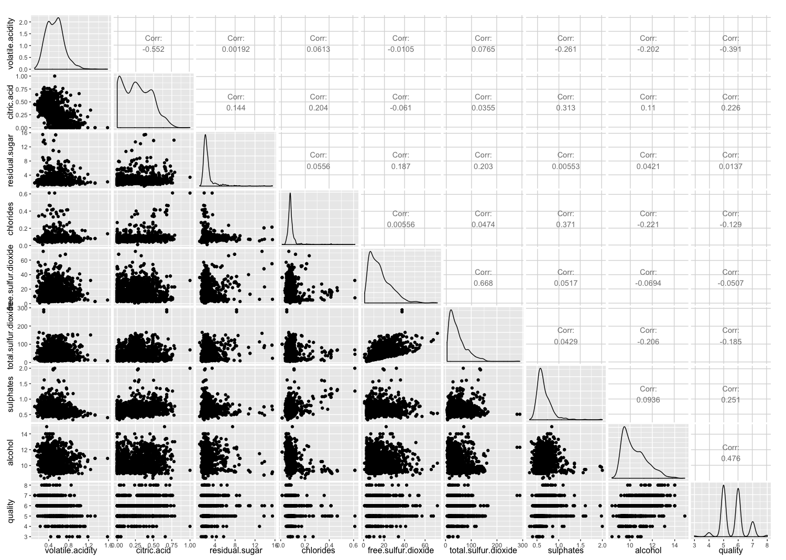

```{r global_options, include=FALSE}
knitr::opts_chunk$set(fig.width=12, fig.height=8, fig.path='Figs/',
                      echo=FALSE, warning=FALSE, message=FALSE)
```

```{r Load the data and install packages, echo=FALSE, message=FALSE, warning=FALSE}
rw <- read.csv('https://s3.amazonaws.com/udacity-hosted-downloads/ud651/wineQualityReds.csv')

library(ggplot2)
library(dplyr)
library(scales)
library(gridExtra)
library(GGally)
```

***

### Guiding question: 

Which chemical properties influence the quality of red wines?

***

## Univariate Exploration and Analysis

```{r Data structure and size, echo = FALSE}
rw$quality.factor <- factor(rw$quality)

dim(rw)
names(rw)
str(rw)
```
[data set description](https://s3.amazonaws.com/udacity-hosted-downloads/ud651/wineQualityInfo.txt)  

```{r Quality graphs, echo = FALSE}
ggplot(data = rw, aes(quality)) +
  geom_bar(color = 'red') +
  scale_y_continuous(breaks = seq(0, 800, 50))

ggplot(data = rw, aes(quality)) +
  geom_bar(color = 'red') +
  scale_y_log10(breaks=c(10, 25, 50, 100, 200, 500, 750)) +
  ggtitle("Quality (Ranking)") +
  labs(y = 'count (log10)')
```

```{r Quality Table, echo=TRUE}
table(rw$quality)
```

The vast majority of the wines got ranked 5 and 6 with each rank away from 5 and 6 having a magnitude less number

```{r ph, Alcohol, Fixed Acidity univariate graphs, echo = FALSE}
ggplot(data = rw, aes(pH)) +
  geom_histogram(binwidth = .05, color = 'red') +
  scale_x_continuous(breaks=seq(1, 5, .1)) +
  ggtitle("pH")

ggplot(data = rw, aes(alcohol)) +
  geom_histogram(binwidth = .5, color = 'red') +
  scale_x_continuous(breaks=seq(0, 20, .5)) +
  ggtitle("Alcohol")

ggplot(data = rw, aes(fixed.acidity)) +
  geom_histogram(binwidth = .2, color = 'red') +
  scale_x_continuous(breaks=seq(0, 20, 1)) +
  ggtitle("Fixed Acidity")
```

Overall acidity, alcohol level, and the fixed acidity all are normally distributed with positive skewness on acohol and fixed acidity.

```{r Citric acid, echo=FALSE}
ggplot(data = rw, aes(citric.acid)) +
  geom_histogram(binwidth = .01, color = 'red') +
  scale_x_continuous(breaks=seq(0,1, .1)) +
  ggtitle("Citric Acid")
```

Citric acid in a large number of wines is 0 and the distribution is relatively flat.

#### Acid summaries (Fixed, volatile)
```{r All acids, echo=TRUE}
summary(rw$fixed.acidity)
summary(rw$volatile.acidity)
```

The measures of acidity seem to be different. Fixed acidity seems to be positively skewed while volatile acidity is less harshly skewed but has some positive outliers.

```{r Chlorides histogram, echo=FALSE}
ggplot(data = rw, aes(chlorides)) +
  geom_histogram(binwidth = 0.025, color = 'red') +
  scale_x_continuous(breaks = seq(0, 1, .05))

ggplot(data = rw, aes(chlorides)) +
  geom_histogram(binwidth = 0.05, color = 'red') +
  scale_x_log10(breaks = pretty_breaks(rw$chlorides, n = 10)) +
  labs(x = 'chlorides (log10)')

ggplot(data = subset(rw, chlorides < quantile(chlorides, .98)), 
       aes(chlorides)) +
  geom_histogram(binwidth = 0.005, color = 'red') +
  scale_x_continuous(breaks = seq(0, .2, .025))
```
```{r Chlordies description, echo=TRUE}
summary(rw$chlorides)
```

There are several major outliers for chloride measurment, but around the mean and median the distribution is normal.


```{r Sulfur Dioxide, echo=FALSE}
ggplot(data = rw, aes(free.sulfur.dioxide)) +
  geom_histogram( color = 'red', binwidth = 2) +
  scale_x_continuous(breaks = seq(0, 75, 8)) +
  labs(x = 'Free Sulfur Dioxide (mg / dm^3)')

ggplot(data = rw, aes(total.sulfur.dioxide)) +
  geom_histogram(color = 'red', binwidth = 5) +
  scale_x_continuous(breaks = seq(0, 400, 15)) +
  labs(x = 'Total Sulfur Dioxide (mg / dm^3)')

ggplot(data = subset(rw, total.sulfur.dioxide < quantile(total.sulfur.dioxide, .99)), 
       aes(total.sulfur.dioxide)) +
  geom_histogram(color = 'red', binwidth = 5) +
  scale_x_continuous(breaks = seq(0, 150, 15)) +
  labs(x = 'Total Sulfur Dioxide (mg / dm^3)')
```

Both measueres of sulfur dioxide (SO2) are positively skewed. According to the description of the data "SO2 concentrations over 50 ppm [are] evident in the nose and taste of wine." It may be interesting later to see what affect this evident taste has on a wine's rating.

```{r Sulfur above 50 ppm, echo=TRUE}
# Number of entries with sulfur ppm above 50.
dim(subset(rw, total.sulfur.dioxide >= 50))[1]
557 / 1599
```

Out of the 1599 entries there are 557 with SO2 above 50. This is about 34.8% of the entries.

```{r Residual Sugars, echo=FALSE}
ggplot(data = rw, aes(residual.sugar)) +
  geom_histogram(color = 'red', binwidth = 0.2)

ggplot(data = rw,
       aes(residual.sugar)) +
  geom_histogram(color = 'red', binwidth = 0.035) +
  scale_x_log10(breaks = seq(0, 16, 2))

ggplot(data = subset(rw,residual.sugar < quantile(residual.sugar, .99)),
       aes(residual.sugar)) +
  geom_histogram(color = 'red', binwidth = 0.2) +
  scale_x_continuous(breaks = seq(0, 8, .4))
```
```{echo=TRUE, Sugars summary}
summary(rw$residual.sugar)
```
Residual sugars distribution is normal with outliers.  
This seems to be a reoccurring pattern. Later it may be interesting to compare the tails with each other to see if there is a correlation between the extremes and good or bad wine.

```{r Density, echo=FALSE}
ggplot(data = rw, aes(density)) +
  geom_histogram(binwidth = .0005, color = 'red') +
  scale_x_continuous(breaks = seq(.985, 1.01, 0.0015))
```

Density is tightly distributed with a normal distribution showing no apparent skewness.

```{r Sulphates, echo=FALSE}
ggplot(data = rw, aes(sulphates)) +
  geom_histogram(binwidth = .03, color = 'red')

ggplot(data = subset(rw, sulphates < quantile(sulphates, .99)), 
       aes(sulphates)) +
  geom_histogram(binwidth = .03, color = 'red') +
  scale_x_continuous(breaks = seq(0, 1.25, .075))
```
```{r Sulphates summary, echo=TRUE}
summary(rw$sulphates)
```

Positively skewed with extreme positive outliers. Also, the entries are fairly spread out. According to the data file sulphates "can contribute to sulfur dioxide gas".

```{r Sulphates and sulfur dioxide, echo=FALSE}
plt1 <- ggplot(data = rw, aes(sulphates)) +
  geom_histogram(binwidth = .03, color = 'red')

plt2 <- ggplot(data = rw, aes(total.sulfur.dioxide)) +
  geom_histogram(color = 'red', binwidth = 5) +
  scale_x_continuous(breaks = seq(0, 300, 15)) +
  labs(x = 'Total Sulfur Dioxide (mg / dm^3)')

grid.arrange(plt1, plt2, ncol = 1)
```

Both do have similar tails, but the total sulfur dioxide is not as normal as the sulphates.  


## Univariate Analysis

#### What is/are the main feature(s) of interest in your dataset?
Mnay of the variables are distributed normally. With the exception of density and alcohol, the distributions are skewed or have extreme outliers. The interesting thing about this is that several of the distributions appear to be skewed in the same direction. Upon further investigation it also seems that they are related chemically (sulphates and SO2).  

These variables should be of interest when comparing multiple varialbes so that we can test if they are actually correlated (and how they pair of variables affect quality).

#### What other features in the dataset do you think will help support your investigation into your feature(s) of interest?
The guiding question is about the quality of wines. All other measurements are about the chemical or physical characteristics of the wines. Therefore, in order to answer the question the variables will have to be compared to the quality individually and eventually in groups. Overall, understanding each measurements affect on a wine and then comparing how that affects the rated quality will be very important in the following (bivariate and multi-variate) analysis.

#### Of the features you investigated, were there any unusual distributions? Did you perform any operations on the data to tidy, adjust, or change the form of the data? If so, why did you do this?
The ratings where all very tightly packed and I had a feeling the number of wines in each rating would drop by a magnitude every rating higher or lower than 5 or 6. This was shown to be approximatley true by chaning the y-axis from continuous to log(10).  

The first chlorides graph I made was very spread out with noticeable outliers, but also signs of a tail. In order to investigate further I changed the x-axis from continuous to log(10). The new graph was better, but there did not appear to be a tail as I had expected and the majority of the data seemed distributed around a fairly small section. Therefore, I decided to simply remove the ouliers (anything above the 98% quaantile) and keep the x-axis continuous. The final graph shows what I had expected after seeing the log graph; normally distributed around a small range with a trickle of outliers that did not represent a signficant positive skewness.  

Total sulphur dioxide (SO2) was positively skewed, similiar to free SO2, but had a couple extreme outliers. To understand the main distribution of total SO2 I removed the values that were greater than the 99th quantile.  

Residual sugars were adjusted by removing the values greater than the 99th quantile and by log transforming the x-axis (done seperately). The log and quantile graph showed the same distribution for the most part, but the quantile graph was easier to understand because of the uniform breaks.  

Sulphates had extreme outliers that were removed so that it was easier to understand the ranges within the main distribution.  

***

## Bivariate Analysis  

```{r Correlation, echo=FALSE, eval=FALSE}
rw.num <- rw[! names(rw) %in% c('X', 'quality.factor')]
rw.corr <- cor(rw.num, method='pearson')

rw.corr
abs(rw.corr) > .5
```

```{r GGpairs, echo=FALSE, eval=FALSE}
col <- c('volatile.acidity', 'citric.acid', 'residual.sugar', 'chlorides', 'free.sulfur.dioxide', 'total.sulfur.dioxide', 'ph', 'sulphates', 'alcohol', 'quality')
ggpairs(data = rw, columns = col)
```
  

There is not a variable that has a clear correlation with quality (e.g., correlation > 0.5).

```{r Sulphates and quality, echo=FALSE, message=FALSE}
ggplot(data = subset(rw, sulphates < quantile(sulphates, .99)), 
       aes(sulphates)) +
  geom_histogram(aes(fill = quality.factor), binwidth = .03) +
  scale_x_continuous(breaks = seq(0, 1.25, .075))

ggplot(data = rw, aes(sulphates)) +
  geom_histogram(aes(fill = quality.factor), binwidth = .02) +
  facet_grid(quality.factor ~ ., scales = 'free_y') +
  scale_x_continuous(breaks = seq(0, 2, .2))
```

As quality goes up the sulphates seem to increase slightly but there is a lot of overlaps between the distributions. 

```{r SO2, echo=FALSE}
ggplot(data = subset(rw, total.sulfur.dioxide < quantile(total.sulfur.dioxide, .99)), 
       aes(x = total.sulfur.dioxide, y = free.sulfur.dioxide)) +
  geom_point(alpha = .25) +
  geom_smooth(method = 'lm', formula = y ~ x) +
  scale_x_continuous(breaks = seq(0, 150, 12))
```

```{r SO2 difference affect on quality, echo=FALSE, warning=FALSE, message=FALSE}
ggplot(data = subset(rw, total.sulfur.dioxide < quantile(total.sulfur.dioxide, .99)), 
       aes(total.sulfur.dioxide - free.sulfur.dioxide)) +
  geom_histogram(aes(fill = quality.factor), binwidth = 4)

ggplot(data = subset(rw, total.sulfur.dioxide < quantile(total.sulfur.dioxide, .99)), 
       aes(total.sulfur.dioxide - free.sulfur.dioxide)) +
  geom_histogram(aes(fill = quality.factor), binwidth = 2) +
  facet_grid(quality.factor ~ ., scales = 'free_y') +
  scale_x_continuous(breaks = seq(0, 150, 12))
  
ggplot(data = subset(rw, total.sulfur.dioxide < quantile(total.sulfur.dioxide, .99)), 
       aes(free.sulfur.dioxide/total.sulfur.dioxide)) +
  geom_histogram(aes(fill = quality.factor), binwidth = 0.03) +
  scale_x_continuous(breaks = seq(0, 1, .1))
  
ggplot(data = subset(rw, total.sulfur.dioxide < quantile(total.sulfur.dioxide, .99)), 
       aes(free.sulfur.dioxide/total.sulfur.dioxide)) +
  geom_histogram(aes(fill = quality.factor), binwidth = 0.03) +
  facet_grid(quality.factor ~ ., scales = 'free_y') +
  scale_x_continuous(breaks = seq(0, 1, .2))
```

It appears that the percent of the SO2 that is free doesn't have a noticeable affect on quality.

```{r Citric acid and quality, echo=FALSE, message=FALSE}
ggplot(data = rw, aes(citric.acid)) +
  geom_histogram(aes(fill=quality.factor), binwidth=.03) +
  scale_x_continuous(breaks = seq(0, 1, .1))

ggplot(data = rw, aes(citric.acid)) +
  geom_histogram(aes(fill=quality.factor), binwidth=.03) +
  facet_grid(quality.factor ~ ., scales = 'free_y') +
  scale_x_continuous(breaks = seq(0, 1, .1))
```

The data at the extreme qualities is rather limited. This makes it hard to pick up on possible trends/correlations. Looking at the graphs it appears that the lower quality citric acid distributions are more left shifted than the higher quality distributions, but there are exceptions (i.e., wines rated 7 and 8).  

```{r Quality and Alcohol, echo=FALSE}
ggplot(data=rw, aes(alcohol)) +
  geom_histogram(aes(fill=quality.factor), binwidth = .4) +
  scale_x_continuous(breaks=seq(0,20, .5))

ggplot(data=rw, aes(alcohol)) +
  geom_histogram(aes(fill=quality.factor), binwidth = .2) +
  scale_x_continuous(breaks=seq(0,20, .5)) +
  facet_grid(quality.factor ~ ., scales='free_y')
```

This shows the best correlation between a variable and quality so far. It is far from perfect. For instance, in the lower rankings the pattern of increasing alcohol does not correlate with a better ranking. In multivariate I should see if another variable and a respectable amount of alcohol make for a bad wine.  

```{r Alcohol and Chlorides, echo=FALSE}
ggplot(data=rw, aes(x = alcohol, y = chlorides)) +
  geom_point()
```

Chlorides may be that other variable I test against. 

```{r Alcohol and Total SO2, echo=FALSE}
ggplot(data=rw, aes(x = alcohol, y = total.sulfur.dioxide)) +
  geom_point(alpha=1/5)

ggplot(data=subset(rw, total.sulfur.dioxide < quantile(total.sulfur.dioxide, .99)), 
       aes(x = alcohol, y = total.sulfur.dioxide)) +
  geom_point(alpha=1/5)
```

```{r Alcohol and Citric Acid, echo=FALSE}
ggplot(data=rw, aes(x = alcohol, y = citric.acid)) +
  geom_point(alpha=1/5)
```
```{r Correlation between Alcohol and Citric Acid, echo=TRUE}
cor.test(rw$alcohol, rw$citric.acid)
```
Both graphs have a blob like scatter. There is no clear trend between just the two variables. It would be interesting to see if a third variable would order or seperate these two variables.

```{r Volatile Acidity and citric acid, echo=FALSE}
ggplot(data=rw, aes(x = citric.acid, y = volatile.acidity)) +
  geom_point(alpha=1/5)
```
```{r Correlation between Volatile Acidity and Citric Acid, echo=TRUE}
cor.test(rw$volatile.acidity, rw$citric.acid)
```

This will be a must explore with quality colored in. Volatile acidity adds a bad vinegar taste in high amounts and citric acid in low (but existant) amounts adds freshness. I would hypothesize that the points on the left will ranked far lower than the points on the right.

```{r Volatile Acidity and Quality, echo=FALSE}
ggplot(data=rw, aes(volatile.acidity)) +
  geom_histogram(aes(fill=quality.factor), binwidth = 0.05)

ggplot(data=rw, aes(volatile.acidity)) +
  geom_histogram(aes(fill=quality.factor), binwidth = 0.05) +
  facet_grid(quality.factor ~ ., scales='free_y')
```

It appears that volatile acidity has an affect on quality. As the quality increases the peaks of each distribution moves right (volatile acidity decreases).  

```{r SO2 greater than 50, echo=FALSE}
ggplot(data=subset(rw, free.sulfur.dioxide >= 50), aes(free.sulfur.dioxide)) +
  geom_histogram(aes(fill=quality.factor), binwidth=1)

ggplot(data=subset(rw, free.sulfur.dioxide < 50), aes(free.sulfur.dioxide)) +
  geom_histogram(aes(fill=quality.factor), binwidth=2)

ggplot(data=subset(rw, total.sulfur.dioxide >= 50), aes(total.sulfur.dioxide)) +
  geom_histogram(aes(fill=quality.factor), binwidth=8)

ggplot(data=subset(rw, total.sulfur.dioxide < 50), aes(total.sulfur.dioxide)) +
  geom_histogram(aes(fill=quality.factor), binwidth=2)
```

If a wine has less than 50 total SO2 ppm then the wine has a noticeabbly higher quality rating.

#### Talk about some of the relationships you observed in this part of the investigation. How did the feature(s) of interest vary with other features in the dataset?

As sulphates increased there seemed to be an increase in the quality. Although it wasn't perfect there did seem to be a noticeable trend.  

As alcohol increased there was an increase in quality. This relationship was much more pronounced than in the sulphates, and there were less extreme outliers in the alcohol distributions than there were in the sulpahtes distribution. 

The less volatile acidity in the wine the better rating it got. This is not universal, there are overlaps between the quality distributions, but it is noticeable.  

If a wine had less than 50ppm of sulphates it was likely to have a much better ranking.

#### Did you observe any interesting relationships between the other features (not the main feature(s) of interest)?
As citric acid increased there was a decrease in volatile acidity. Therefore, I thought that there would be a correlation between citric acid and quality. However, there was no correlation between citric acid and quality.  

I wonder if the wines with low volatile acidity, but not ranked high were due to a high citric acid (possible too high thus driving down the volatile acidity artifically).

#### What was the strongest relationship you found?
It is a tie between alcohol's and volatile acidity's relationship with quality. 

***

## Multivariate Analysis


```{r Total vs. Free SO2 and quality, echo=FALSE}
ggplot(data = subset(rw, total.sulfur.dioxide < quantile(total.sulfur.dioxide, .99)), 
       aes(x = total.sulfur.dioxide, y = free.sulfur.dioxide)) +
  geom_point(aes(color=quality.factor)) +
  facet_grid(quality.factor ~ .) +
  scale_x_continuous(breaks = seq(0, 150, 12))

ggplot(data = subset(rw, total.sulfur.dioxide < quantile(total.sulfur.dioxide, .99)), 
       aes(x = total.sulfur.dioxide, y = free.sulfur.dioxide/total.sulfur.dioxide)) +
  geom_point(aes(color=quality.factor)) +
  facet_grid(quality.factor ~ .) +
  scale_x_continuous(breaks = seq(0, 150, 12))
```

Nothing stands out in the graphs above.
  
```{r Fixed and volatile acid with quality, echo=FALSE}
ggplot(data = rw, aes(x = fixed.acidity, y = volatile.acidity)) +
  geom_point(aes(color=quality.factor)) +
  geom_hline(yintercept=mean(rw$volatile.acidity), linetype=2, alpha=1/2) 
```

There doesn't seem to be any grouping between volatile and fixed acidity. In addition, there is not clear pattern with relation to quality in the relationship either. Again, all that is clear is that wines with low volatitle acidity are ranked better (the dashed line is the mean for volatile acidity).

```{r Citric and volatile acid with quality, echo=FALSE}
ggplot(data = rw, aes(y = citric.acid, x = volatile.acidity)) +
  geom_point(aes(color=quality.factor))

ggplot(data = rw, aes(y = citric.acid, x = volatile.acidity)) +
  geom_point(aes(color=quality.factor)) +
  facet_grid(quality.factor ~ .)

ggplot(data = rw, aes(y = citric.acid, x = fixed.acidity)) +
  geom_point(aes(color=quality.factor))
```

Seems to be a grouping of blue that has moderate amounts of citric acid and low volatile acidity.

```{r Citric and volatile acid with quality subset, echo=FALSE}
ggplot(data = subset(rw, volatile.acidity < .6), 
       aes(y = citric.acid, x = volatile.acidity)) +
  geom_point(aes(color=quality.factor)) +
  geom_vline(xintercept=mean(rw$volatile.acidity), linetype=2, alpha=1/2) +
  geom_hline(yintercept=quantile(rw$citric.acid, .85), linetype=2, alpha=1/2) 
```

Each dashed line is the mean. Nothing new. Wines with low volatile acidity are rated better, but we already knew that.

```{r High citric acid and low volatile acidity, echo=FALSE}
ggplot(data=subset(rw, citric.acid > quantile(citric.acid, .5) & 
                     volatile.acidity < quantile(volatile.acidity, .5)), 
       aes(quality.factor)) +
  geom_bar(fill='blue')+
  geom_bar(data=rw, fill='red', alpha=.5) +
  geom_bar(data=subset(rw, citric.acid > quantile(citric.acid, .75) & 
                     volatile.acidity < quantile(volatile.acidity, .25)), fill='blue')
```

Nothing really useful here. The blue is citric acid in the top quarter quantile and volatile acid in bottom quarter quantile. Purple is citric in bottom half quantile and volatile in top half quantile.  
I was hoping to see a relationship between the two affecting quality, but because I'm taking smaller and smaller subset I have no idea if it is signifcant when I can only compare it overall.

```{r Alcohol and Volatile Acidity with quality, echo=FALSE}
ggplot(data=rw, aes(y = alcohol, x = volatile.acidity)) +
  geom_point(aes(color=quality.factor))

ggplot(data=subset(rw, volatile.acidity < .5), 
       aes(y = alcohol, x = volatile.acidity)) +
  geom_point(aes(color=quality.factor)) +
  facet_grid(. ~ quality.factor) +
  labs(x = 'Volatile Acidity (Less than .5)')
```

There seems to be a grouping of blue with high alcohol and low volatile acidity.

```{r Alcohol and Sulphates with quality, echo=FALSE}
ggplot(data=subset(rw, sulphates < quantile(sulphates, .98)), 
       aes(y = alcohol, x = sulphates)) +
  geom_point(aes(color=quality.factor))

ggplot(data=subset(rw, sulphates < quantile(sulphates, .98)), 
       aes(y = alcohol, x = sulphates)) +
  geom_point(aes(color=quality.factor)) +
  facet_grid(quality.factor ~ .)
```

As sulphates and alcohol increase there appears to be an increase in quality.

```{r Alcohol and total SO2 less than 50, echo=FALSE}
ggplot(data = subset(rw, total.sulfur.dioxide < 50), 
       aes(x = alcohol, y = total.sulfur.dioxide)) +
  geom_point(aes(color=quality.factor))

ggplot(data = subset(rw, total.sulfur.dioxide < 50), 
       aes(x = alcohol, y = total.sulfur.dioxide)) +
  geom_point(aes(color=quality.factor)) +
  facet_grid(quality.factor ~ .)
```

Nothing of interest.

```{r Good SO2 and sweet, echo=FALSE}
ggplot(data = subset(rw, free.sulfur.dioxide < 50), 
       aes(x = alcohol, y = free.sulfur.dioxide)) +
  geom_point(aes(color=quality.factor))
```

```{r Sulphates and free SO2 with quality, echo=FALSE}
ggplot(data=rw, aes(y = sulphates, x = free.sulfur.dioxide/total.sulfur.dioxide)) +
  geom_point(aes(color=quality.factor))
```

Nothing of interest.

```{r volatile acidity and sulphates, echo=FALSE}
ggplot(data=subset(rw, volatile.acidity < .5), 
       aes(y = sulphates, x = volatile.acidity)) +
  geom_point(aes(color=quality.factor)) +
  geom_hline(yintercept=mean(rw$sulphates), linetype=2, alpha=.5)
```

Nothing of interest. The horizontal line is the mean value of sulphates.

```{r Sulpahtes and Alcohol with Quality where volatile acidity is low}
ggplot(data=subset(rw, sulphates < quantile(sulphates, .98) 
                   & volatile.acidity < mean(volatile.acidity)), 
       aes(y = alcohol, x = sulphates)) +
  geom_point(aes(color=quality.factor)) +
  geom_hline(yintercept=mean(rw$alcohol), linetype=2, alpha=1/2) +
  geom_vline(xintercept=mean(rw$sulphates), linetype=2, alpha=1/2)
```

Here is a plto os sulpahtes and alochol, but with wines that have low volatile acidity. It drastically reduces the number of bad and mediocore wines.  

#### Talk about some of the relationships you observed in this part of the investigation. Were there features that strengthened each other in terms of looking at your feature(s) of interest?

Alcohol was a consisten factor that improved quality. In addition, with low volatile acidity and high sulphates there was a stronger relationship with quality.

#### Were there any interesting or surprising interactions between features?

I was expecting a free SO2 to have more of an affect because of its affect on taste, but it seems that the total SO2 had more of an affect.

***

# Final Plots and Summary

### Plot One
```{r echo=FALSE, Plot_One}
ggplot(data = rw, aes(quality.factor)) +
  geom_bar(color = 'red') +
  scale_y_log10(breaks=c(10, 25, 50, 100, 200, 400, 800)) +
  ggtitle("Quality (Ranking)") +
  labs(y = 'count (log10)', x= 'Quality') +
  ggtitle("Distribution of Quality")
```

### Description One

The majority of the wines are rated 5 or 6. The number of wines rated something else drops by a magnitude the farther away it gets from 5 or 6.

### Plot Two
```{r echo=FALSE, Plot_Two}
ggplot(data=rw, aes(alcohol)) +
  geom_histogram(aes(fill=quality.factor), binwidth = .3) +
  scale_x_continuous(breaks=seq(0,20, .5)) +
  geom_vline(xintercept=mean(rw$alcohol), linetype=2, alpha=1/2) +
  geom_vline(xintercept=quantile(rw$alcohol, .85), linetype=2, alpha=1/2, color='red') +
  labs(x='Alcohol (%)', fill='Quality') +
  ggtitle("Quality by Alcohol")
```

### Description Two

As alcohol increases there is trend of the wines improving in quality. The higher quality wines are a much larger proportion of the total number of wines when looking at wines with alcohol greater than the mean (to the right of the black dashed line). Also, almost all the wines with alcohol in the top 15% (to the right of the red dashed line) are high quality wines.   
Perhaps this is because the longer a wine matures the more time yeast has to turn sugars into alcohol. This may mean that older wines are generally rated higher.   

### Plot Three
```{r echo=FALSE, Plot_Three}
ggplot(data=subset(rw, sulphates < quantile(sulphates, .98)), 
       aes(y = alcohol, x = sulphates)) +
  geom_point(aes(color=quality.factor), size=2) +
  geom_hline(yintercept=mean(rw$alcohol), linetype=2, alpha=1/2) +
  geom_vline(xintercept=mean(rw$sulphates), linetype=2, alpha=1/2) +
  labs(x = 'Sulphates (g / dm3)', y = 'Alcohol', color='Quality') +
  ggtitle("Quality by Sulphates and Alcohol")
```

### Description Three

The dashed lines are the mean alcohol level and mean sulphates. Wines with sulphates and alcohol  above the mean are rated better than wines with sulphates and alcohol below the mean. Each variable individually had an effect on quality and it is clear that when combined both have an even greater affect.

***

# Reflection

I started by looking at what was included in the dataset, what each variable was, and how the variables affected wine. Next, I began by examining the distributions of the different variables. From this I found that a lot of the data was normally distributed with either a positive skew or extreme outliers. Then I looked at how two variables affected one another only to find no clear correlation between variables I thought would be related. Therefore, I moved on a looked at varaibles distributions' overlayed with quality. This produced some interesting results because it was possible to see what was previously a normal distribution become a distribution that showed quality following a trend. Using what I found in the bivariate section,  I next explored how two variables had an affect on quality. I was hoping to find new interactions between variables that would have a clear affect on quality. I found that variables I knew had an affect on quality working together to make the improved qualities more noticeable and the variables I though might work together showed no sign of improving quality.  

There are limitations to the data. There are only 1599 observations and the number of wines with quality not 5 or 6 is very low so trying to find patterns that differentiate wines based on quality is hard. In addition, the wines are only of one type, Portuguese "Vinho Verde" wine, which means that the results found here cannot be applied to all red wines in general. Finally, there are other variables not included that would be useful, such as length of fermentation, grape type, and year grape was grown. Overall, more observations and observations that were not purely chemical would help make this data set better.